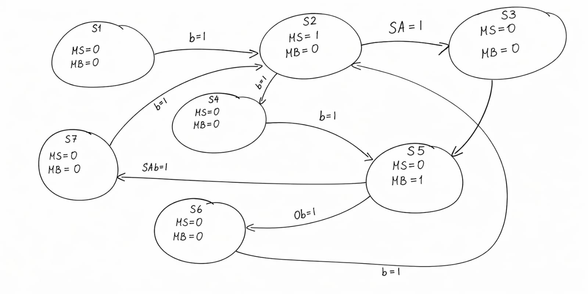

<!---

This file is used to generate your project datasheet. Please fill in the information below and delete any unused
sections.

You can also include images in this folder and reference them in the markdown. Each image must be less than
512 kb in size, and the combined size of all images must be less than 1 MB.
-->

## How it works

The project implements a finite state machine (FSM) that controls the behavior of an automatic garage door opener. The system changes state with each clock pulse (clk) and can be reset with the rst signal, returning to its initial state.
The operation is based on the following inputs:
b (button): al presionar el boton, sube, baja o detiene la puerta.
SA and SAB (position sensors):Cuando detecten ya sea arriba o abajo, los motores se detienen.
ob (obstruction):cuando este se hace presente, la puerta se detiene por un momento y despues sube.
Depending on the current state and the inputs, the system determines the next state and activates the outputs:
MS (upward motor):Es el encargado de subir la puerta.
MB (downward motor):Es el encargado de bajar la puerta.
The general flow is:
At rest, it waits for the button to be pressed.
It activates the upward motor (MS) until it detects sensor SA.
It stops and waits for another button press.
Then it activates the downward motor (MB).
If it detects sensor SAB, the cycle ends.
If it detects an obstruction (ob), it enters a safety state and stops the system.

## How to test
Activate the reset (rst=1) to initialize the system and then reset it to 0.
Press the button (b=1) to start the process.
Activate the SA sensor to simulate the door reaching a certain position.
Press the button again to initiate closing.
Activate:
SAB to indicate complete closure, or
ob to simulate an obstruction.
Observe the LEDs:
MS on indicates up movement.
MB on indicates down movement.

## External hardware

1 button → b (system control)
2 switches → SA and SAB (position sensors)
1 switch → rst (system reset)
1 switch → ob (obstruction detection)
1 LED → MS (indicates motor up)
1 LED → MB (indicates motor down)
